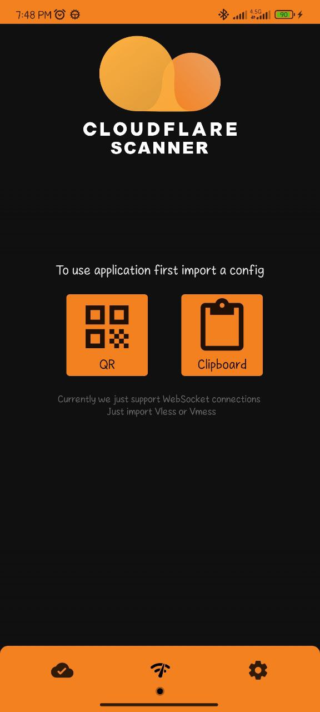
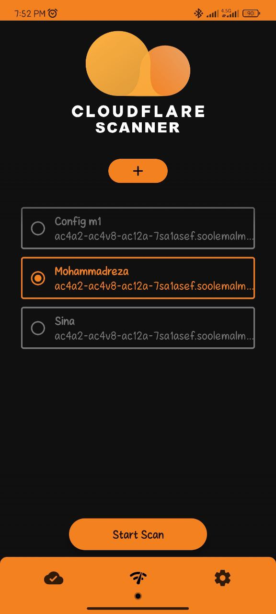
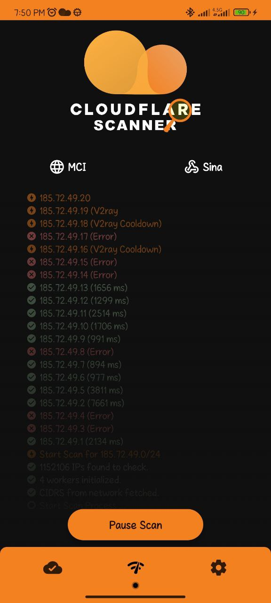
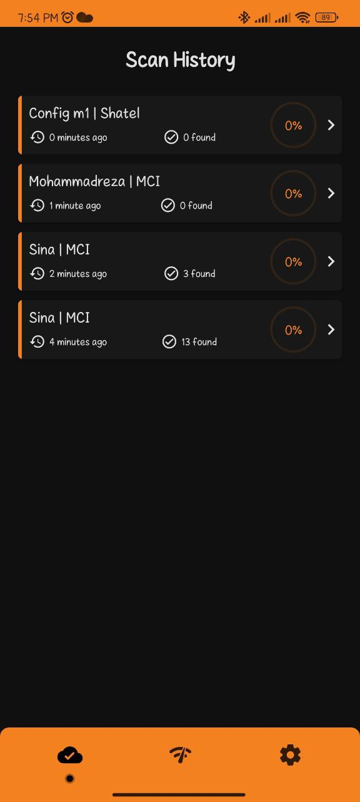
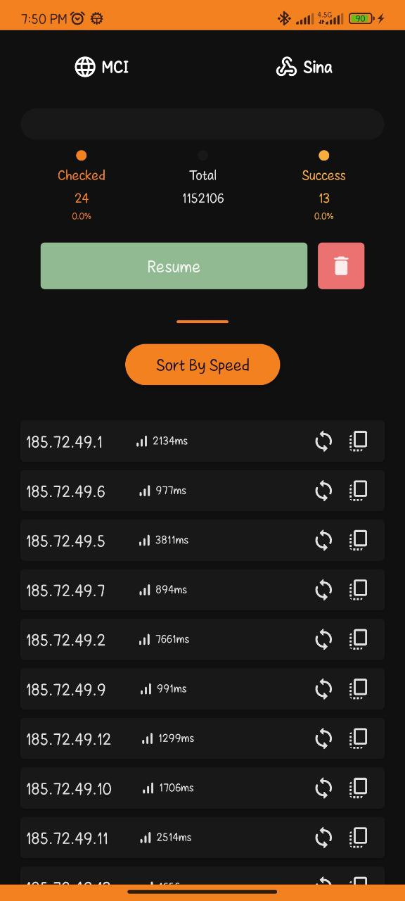
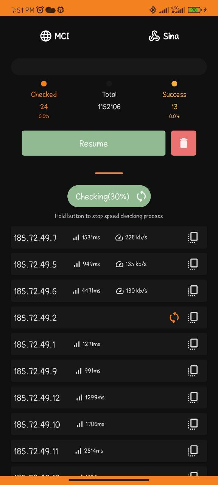
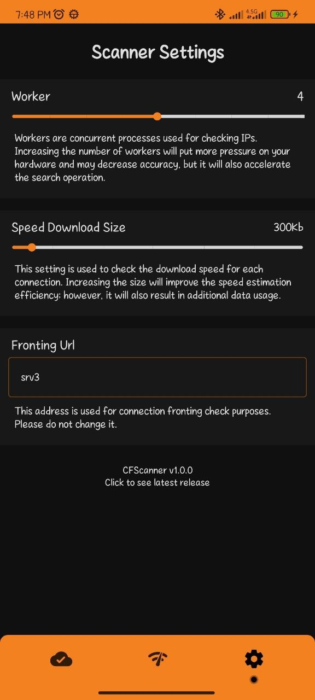
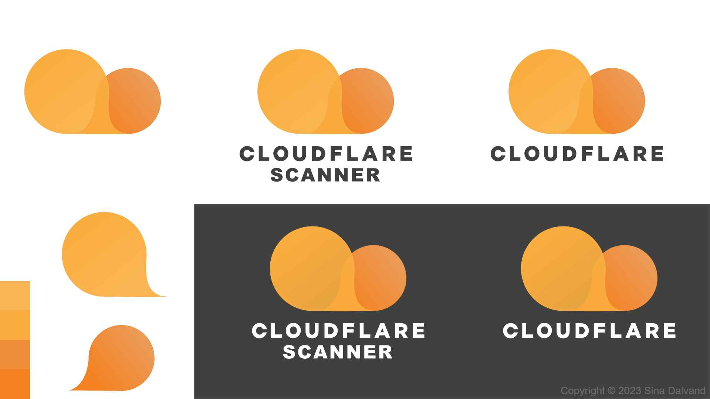

<br>
<p align="center">

</p>
<h1 align="center">Cloudflare Scanner</h1>
<p align="center">This Android application allows users to scan Cloudflare IPs using a real V2ray client by inputting their config details and evaluating each address based on download speed. This enables them to identify the best IP addresses for optimal connection. The app provides a user-friendly interface for users to easily navigate and select their preferred IP addresses, as well as the ability to save results for later use.</p>

<h6 align="center">
</h6>

## Contents

- [📱 Installation](#📱-Installation)
- [✨ Features & Screenshots](#✨-Features-&-Screenshots)
    - [🔍 Scan Screen](#🔍-Scan-Screen)
    - [🧾 History Screen](#🧾-History-Screen)
    - [⚙️ Settings Screen](#⚙️-Settings-Screen)
- [🧑‍💻 Technical Overview](#🧑‍💻-Technical-Overview)
- [⚒️ Upcoming Features](#⚒️-Upcoming-Features)
- [🤝 Contribution Guidelines](#🤝-Contribution-Guidelines)
- [📄 Licence](#📄-Licence)

## 📱 Installation

<pre>
You can download application APK from <a href="https://github.com/MortezaBashsiz/CFScanner/releases">release section</a> in right side of page 

If you are confused about which version to download, you should choose
APk by the name of CFScanner-X.X.X-release-all.apk

application does not require any special permission to run.
</pre>

## ✨ Features & Screenshots

### 🔍 Scan Screen

| Scan Screen (Import) | Scan Screen (List) | Scan Screen (Scan) |
|----------------------|--------------------|--------------------|
|    |  |  | 

#### Scan Button

**Note: scan button will appear when detect your ISP and network connection, please be patient**
</br></br>

#### Import Config

At first users must input their configs by Copy or Scan QR option then use application.
</br></br>

#### Edit/Delete Config

To edit or Delete a config, long press on it.
</br></br>

### 🧾 History Screen

| History Screen (List) | History Screen (Details) | History Screen (Speed) |
|-----------------------|--------------------------|------------------------|
|  |     |   | 

#### Resume Button

You can resume interrupted or paused scan
</br></br>

#### Sort By Speed Button

This feature will help you to find best IP among other by downloading small file and
evaluate ip be connection speed.</br>
**Note: you can select download size for this part in Settings screen.**
</br></br>

### ⚙️ Settings Screen

| Settings Screen |
|------------------------------------------------------------------|
|                       | 

#### Worker Seekbar

Select concurrent worker for scanning operation.</br>
**Note: Increase in number of workers make scan faster, but will put more pressure
on your phone!**
</br></br>

#### Speed Download Size

As mentioned it will specify download size for speed checking process.</br>
**Note: Increasing the size of sample used for estimation may improve accuracy, but it may also
result in increased data usage**
</br></br>

#### Fronting Url

Use to check access to this address through founded Ip in Scanning operation. </br>
**Note: Please avoid changes this field if you are not familiar with usage**
</br></br>

## 🧑‍💻 Technical Overview

### How it started?

After encountering limitations with the V2ray client's filtering capabilities In China and Iran and
realizing the need for a more efficient and portable solution, this application was created to
enable users to perform scanning operations directly on their Android devices. With the ability to
resume scans and a user-friendly interface, it provides a convenient alternative to traditional
computer-based scanning.

### Structure and Architecture

This application was developed using Kotlin programming language and follows the Model-View-Intent (
MVI) architecture pattern. The application also leverages the power of Compose, the modern Android
UI toolkit, for building the user interface instead of the traditional XML layout approach.
Additionally, C++ was used to disable ``fdsan`` to avoid fatal error for native third-party library.

### Dependencies

* Compose
* Coroutine
* Compose Animation
* Compose Navigation
* Firebase Analytics
* OkHttp,Retrofit
* Room Database
* Dagger(DI)
* RxJava
* [LeakCanary](https://square.github.io/leakcanary/)
* Accompanist Permissions
* Accompanist Navigation Animation
* [Barcode scanner](https://github.com/dm77/barcodescanner)
* [KotPref ](https://github.com/chibatching/Kotpref)
* [Timber(Log) ](https://github.com/JakeWharton/timber)
* [V2ray Client](https://github.com/2dust/AndroidLibV2rayLite)

### Design

I designed the logo using AdobeXD and incorporated its color scheme throughout the application.
<br>
**Note: Design is accessible in ``art/logo.xd``for AdobeXD**

### Build and Run

To Build application you need `google-services.json`  file in app directory, you can get it from
firebase console.Also you need ``NDK`` for build native library.

**Note: You can set default Fronting Url in ``local.properties`` file like:**
```
fronting_address = "your address without https"
```
## ⚒️ Upcoming Features

- [ ] Implement inner VPN service
- [x] Resume Old Scan
- [ ] Add Auto Switch Feature to VPN
- [ ] Sync Best IPs for each ISP
- [ ] Random CIDR picking
- [ ] Persian/Chinese Language Support

## 🤝 Contribution Guidelines

We welcome contributions from anyone who is interested in improving this project! Here are some
guidelines to keep in mind as you get started:

* Fork the repository and create a new branch for your contribution.
* Make your changes in the new branch, ensuring that your code follows the project's coding style
  and guidelines.
* Write clear and concise commit messages to describe your changes.
* Test your changes thoroughly to ensure that they work as expected.
* Submit a pull request with your changes and a brief description of what you've done.

We'll review your contribution as soon as possible and provide feedback if necessary. We may ask you
to make changes to your code or documentation before we can merge your pull request.

Please be patient as we review your contribution, and feel free to reach out if you have any
questions or concerns. We appreciate your efforts to improve this project and look forward to
working with you!

## 📄 Licence

```
Copyright (c) 2023 Sina Dalvand

This program is free software: you can redistribute it and/or modify
it under the terms of the GNU General Public License as published by
the Free Software Foundation, either version 3 of the License, or
(at your option) any later version.

This program is distributed in the hope that it will be useful,
but WITHOUT ANY WARRANTY; without even the implied warranty of
MERCHANTABILITY or FITNESS FOR A PARTICULAR PURPOSE. See the
GNU General Public License for more details.

You should have received a copy of the GNU General Public License
along with this program. If not, see https://www.gnu.org/licenses/.

Note that this conversion assumes that you have the right to make this change to 
the license, as it may depend on the terms of any third-party libraries or code 
that your project uses.
```
## ☎️ Contact
reach me at:<br>
[Email: dalvandsina@yahoo.com](mailto:dalvandsina@yahoo.com)
